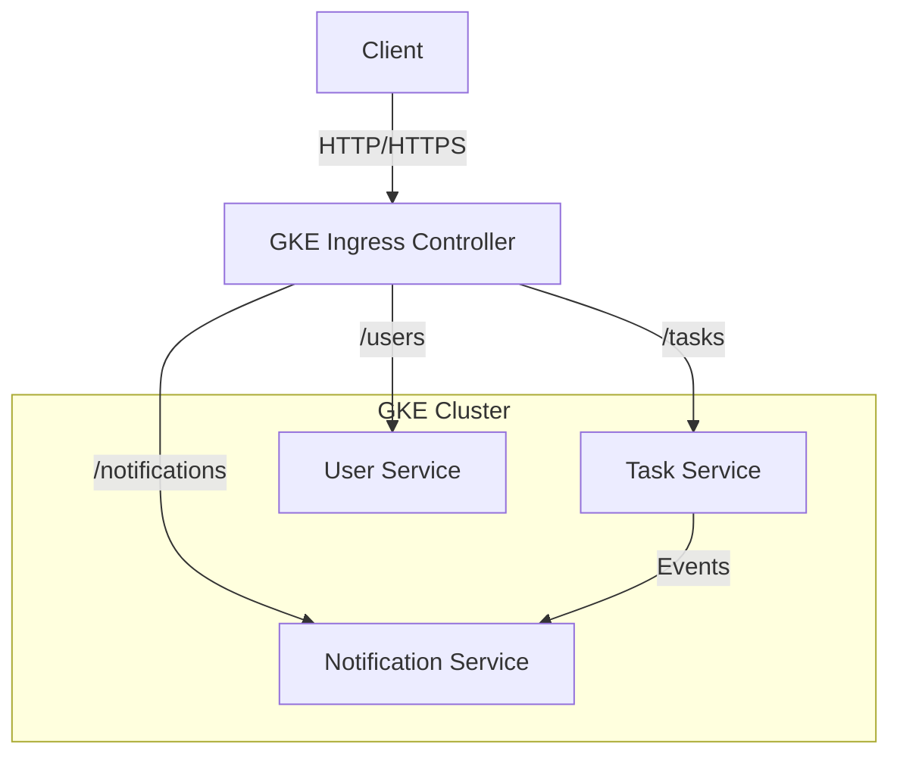

# KubeCloudPipeline 🚀

A production-ready microservices architecture showcasing DevOps best practices, git workflow, and Kubernetes orchestration.


## 🏗 System Architecture

The system consists of three decoupled microservices running on Google Kubernetes Engine (GKE), accessible via a centralized Ingress.



## 📦 Microservices

| Service | Description | Port | Tech Stack |
| :--- | :--- | :--- | :--- |
| **[task-service](./task-service)** | Core business logic for task management | `8081` | Java, Quarkus |
| **[user-service](./user-service)** | User identity and profile management | `8082` | Java, Quarkus |
| **[notification-service](./notification-service)** | Async notifications (Email/SMS simulation) | `8083` | Java, Quarkus |

## 🛠 Git Workflow

We follow a strict **Feature Branch Workflow**:

1.  **`main`**: Production-ready code. Protected branch.
2.  **`dev`**: Integration branch for testing. Auto-deploys to Dev GKE namespace.
3.  **`feature/sprint-xx-name`**: Development branches.

### Contribution Process
1.  Create a branch: `git checkout -b feature/sprint-xx-my-feature`
2.  Commit changes (Conventional Commits): `git commit -m "feat: add user authentication"`
3.  Pull Request -> `dev`
4.  Squash & Merge
5.  CI/CD Pipeline triggers Build & Deploy.

## 📅 Sprint Journey

| Sprint | Goal | Status | Documentation |
| :--- | :--- | :--- | :--- |
| **01** | Repo Init & Local Setup | ✅ Completed | [View Doc](./docs/sprint-01-init.md) |
| **02** | REST API Implementation | ✅ Completed | [View Doc](./docs/sprint-02-rest-api.md) |
| **03** | CI/CD Design | ✅ Completed | [View Doc](./docs/sprint-03-cicd-design.md) |
| **04** | Cloud Build Setup | ✅ Completed | [View Doc](./docs/sprint-04-cloudbuild.md) |
| **05** | GKE Environment Setup | ✅ Completed | [View Doc](./docs/sprint-05-gke.md) |
| **06** | Microservices Deployment | ✅ Completed | [View Doc](./docs/sprint-06-microservices.md) |
| **07** | Ingress & Scaling | ✅ Completed | [View Doc](./docs/sprint-07-ingress.md) |

## 🚀 Deployment

### Prerequisites
- Google Cloud Project
- Kubernetes Cluster (GKE)
- `gcloud` CLI & `kubectl`

### Quick Start
```bash
# 1. Clone Repo
git clone https://github.com/saiflayouni/KubeCloudPipeline.git

# 2. Setup Configs
./scripts/setup-gke-namespaces.sh

# 3. Deploy (Manual Trigger via Cloud Build)
gcloud builds submit --config=cloudbuild-task.yaml .
```
